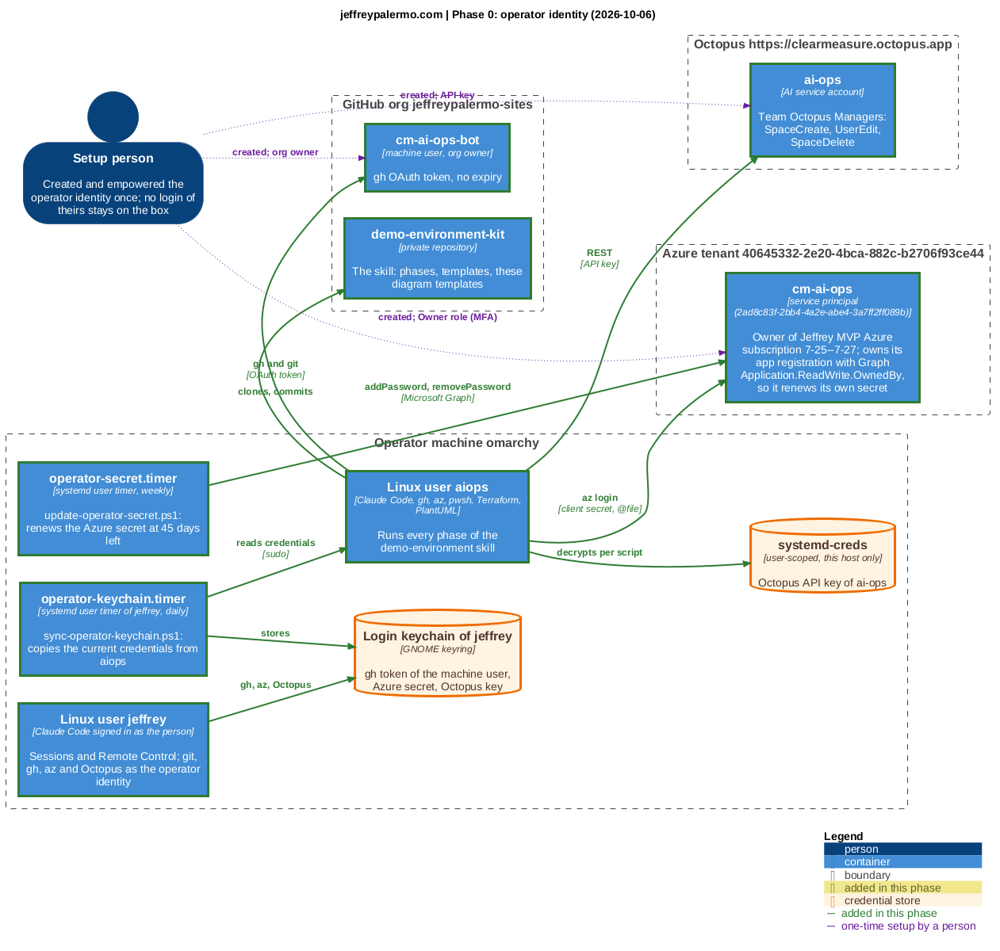
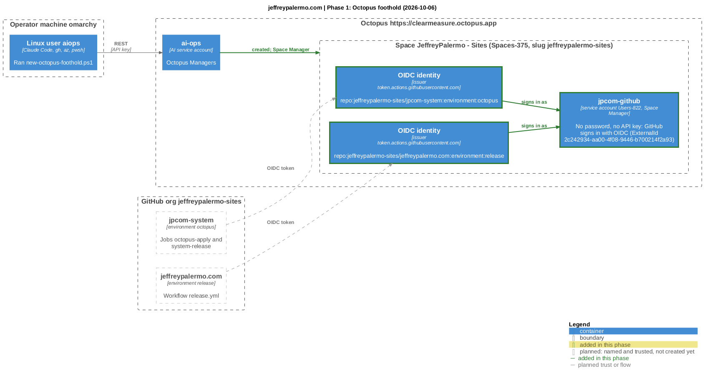
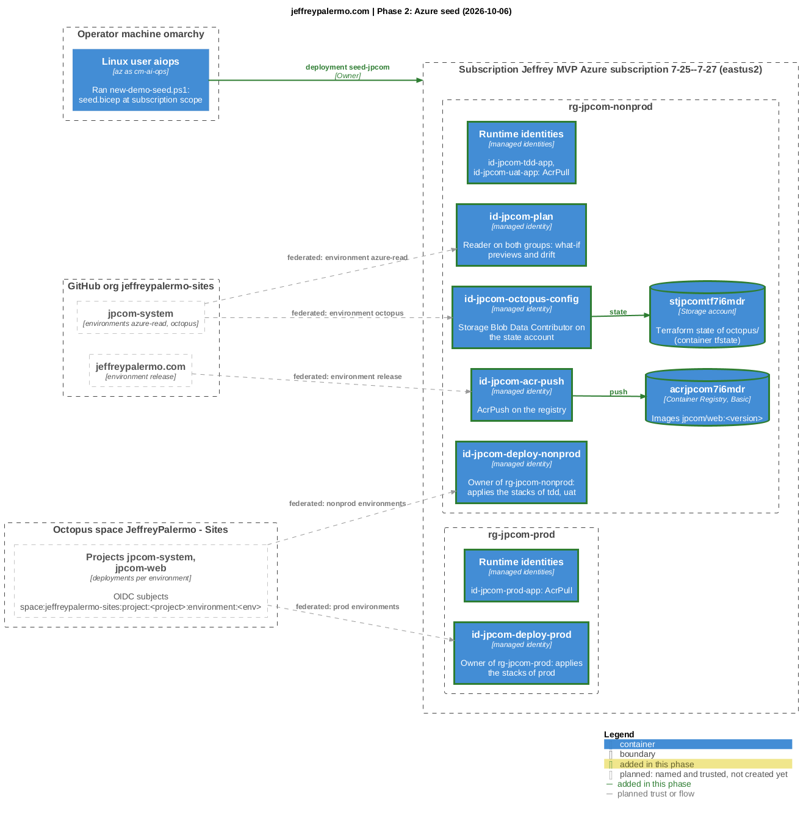
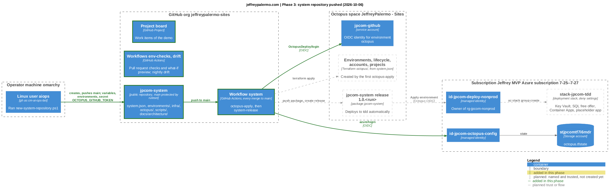

# Architecture, phase by phase

Each diagram shows the whole DevOps and GitOps architecture of this system as implemented after one phase of the demo-environment skill. Elements with a green border were added in that phase; dashed elements are names already trusted (a federated subject, an OIDC identity) but not created yet.

The `.puml` files are the sources (C4-PlantUML); the `.png` files are rendered from them by `write-architecture-diagrams.ps1` in the demo-environment kit.

## Phase 0: operator identity (2026-10-06)

Source: [00-operator-identity.puml](00-operator-identity.puml)

## Phase 1: Octopus foothold (2026-10-06)

Source: [01-octopus-foothold.puml](01-octopus-foothold.puml)

## Phase 2: Azure seed (2026-10-06)

Source: [02-azure-seed.puml](02-azure-seed.puml)

## Phase 3: system repository pushed (2026-10-06)

Source: [03-system-repository.puml](03-system-repository.puml)
